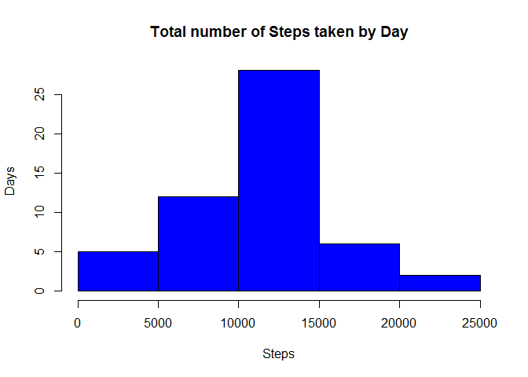

# Reproducible Research: Peer Assessment 1


## Loading and preprocessing the data


```r
activity <- read.csv("activity.csv", colClasses = c("numeric", "character", 
    "numeric"))
head(activity)
```

```
##   steps       date interval
## 1    NA 2012-10-01        0
## 2    NA 2012-10-01        5
## 3    NA 2012-10-01       10
## 4    NA 2012-10-01       15
## 5    NA 2012-10-01       20
## 6    NA 2012-10-01       25
```


```r
names(activity)
```

```
## [1] "steps"    "date"     "interval"
```


```r
library(lattice)

activity$date <- as.Date(activity$date, "%Y-%m-%d")
activity$interval <- as.factor(activity$interval)
```

## What is mean total number of steps taken per day?

Let's use the aggregate function for this.

```r
StepsTaken <- aggregate(steps ~ date, data = activity, sum,na.rm = TRUE)
```

We can view a bar chart for this now

```r
hist(StepsTaken$steps,main = "Total number of Steps taken by Day",xlab="Steps",ylab = "Days", col="blue")
```



In order to find the mean, we can just use the mean function on the steps column

```r
meanSteps <- mean(StepsTaken$steps,na.rm=TRUE)
medianSteps <- median(StepsTaken$steps,na.rm=TRUE)
```


The Mean is 1.07662\times 10^{4} and the median is 1.0765\times 10^{4}.

## What is the average daily activity pattern?


## Imputing missing values


## Are there differences in activity patterns between weekdays and weekends?
