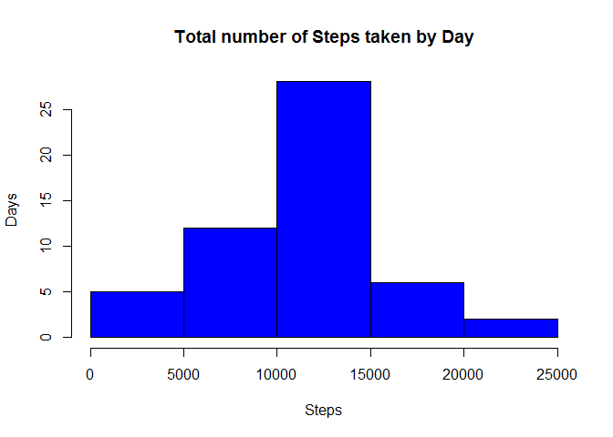
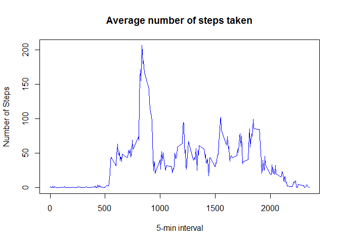
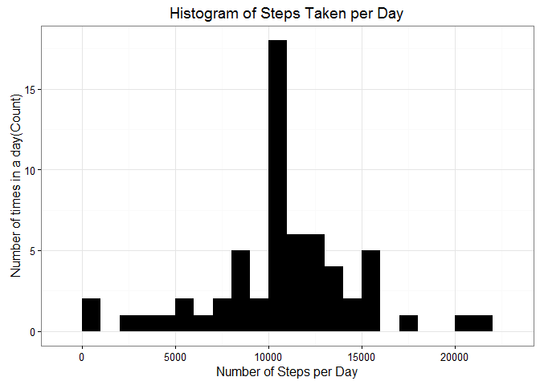
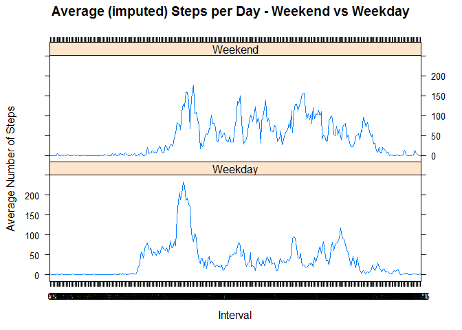

# Reproducible Research: Peer Assessment 1
Umar Iyoob  


## Loading and preprocessing the data

####Load the data (i.e. read.csv())

```r
activity <- read.csv("activity.csv", colClasses = c("numeric", "character", 
    "numeric"))
head(activity)
```

```
##   steps       date interval
## 1    NA 2012-10-01        0
## 2    NA 2012-10-01        5
## 3    NA 2012-10-01       10
## 4    NA 2012-10-01       15
## 5    NA 2012-10-01       20
## 6    NA 2012-10-01       25
```

```r
str(activity)
```

```
## 'data.frame':	17568 obs. of  3 variables:
##  $ steps   : num  NA NA NA NA NA NA NA NA NA NA ...
##  $ date    : chr  "2012-10-01" "2012-10-01" "2012-10-01" "2012-10-01" ...
##  $ interval: num  0 5 10 15 20 25 30 35 40 45 ...
```


```r
names(activity)
```

```
## [1] "steps"    "date"     "interval"
```

####Process/transform the data (if necessary) into a format suitable for your analysis

```r
library(lattice)

activity$date <- as.Date(activity$date, "%Y-%m-%d")
activity$interval <- as.factor(activity$interval)
```

## What is mean total number of steps taken per day?

###Calculate the total number of steps taken per day
Let's use the aggregate function for this.

```r
StepsTaken <- aggregate(steps ~ date, data = activity, sum,na.rm = TRUE)
```

####Make a histogram of the total number of steps taken each day

```r
hist(StepsTaken$steps,main = "Total number of Steps taken by Day",xlab="Steps",ylab = "Days", col="blue")
```



####Calculate and report the mean and median of the total number of steps taken per day
The Mean is:

```r
meanSteps <- mean(StepsTaken$steps,na.rm=TRUE)
meanSteps
```

```
## [1] 10766.19
```

and the median is:

```r
medianSteps <- median(StepsTaken$steps,na.rm=TRUE)
medianSteps
```

```
## [1] 10765
```


## What is the average daily activity pattern?

####Make a time series plot (i.e. type = "l") of the 5-minute interval (x-axis) and the average number of steps taken, averaged across all days (y-axis)

```r
timeSeriesPat <- tapply(activity$steps, activity$interval, mean, na.rm = TRUE)
```

We plot the time series graph by:

```r
plot(row.names(timeSeriesPat), timeSeriesPat, type = "l", xlab = "5-min interval", 
    ylab = "Number of Steps", main = "Average number of steps taken", 
    col = "blue")
```



####Which 5-minute interval, on average across all the days in the dataset, contains the maximum number of steps?

To find that, 

```r
MaxStepAvg <- which.max(timeSeriesPat)
IntervalWithMaxStepAvg <- names(MaxStepAvg)
```

The 5-minute interval 835 contains the maximum number of steps on average across all the days.

## Imputing missing values

####Calculate and report the total number of missing values in the dataset (i.e. the total number of rows with NAs)

```r
NumOfNAs <- sum(is.na(activity))
```

There are 2304 missing values in the dataset.

####Devise a strategy for filling in all of the missing values in the dataset.

```r
StepAvg <- aggregate(steps ~ interval, data = activity, FUN = mean)

fillNAs <- numeric()
for (i in 1:nrow(activity)) {
    obs <- activity[i, ]
    if (is.na(obs$steps)) {
        steps <- subset(StepAvg, interval == obs$interval)$steps
    } else {
        steps <- obs$steps
    }
    fillNAs <- c(fillNAs, steps)
}
```

####Create a new dataset that is equal to the original dataset but with the missing data filled in.

```r
filledActivity <- activity
filledActivity$steps <- fillNAs
```

####Make a histogram of the total number of steps taken each day and Calculate and report the mean and median total number of steps taken per day. Do these values differ from the estimates from the first part of the assignment? What is the impact of imputing missing data on the estimates of the total daily number of steps?

We shall do this with ggplot2 for a change.


```r
library(ggplot2)

AllStepsPerDay <- aggregate(steps ~ date, filledActivity, sum)

colnames(AllStepsPerDay) <- c("date","steps")

ggplot(AllStepsPerDay, aes(x = steps)) + 
       geom_histogram(fill = "black", binwidth = 1000) + 
        labs(title="Histogram of Steps Taken per Day", 
             x = "Number of Steps per Day", y = "Number of times in a day(Count)") + theme_bw()
```



In order to find the mean, we can just use the mean function on the new steps column
The new Mean is:

```r
filledMeanSteps <- mean(AllStepsPerDay$steps, na.rm=TRUE)
filledMeanSteps
```

```
## [1] 10766.19
```
and the old mean was:

```r
meanSteps
```

```
## [1] 10766.19
```

The new median is:

```r
filledMedianSteps <- median(AllStepsPerDay$steps, na.rm=TRUE)
filledMedianSteps
```

```
## [1] 10766.19
```
and the old median was:

```r
medianSteps
```

```
## [1] 10765
```

From the result, we can see that the mean and the median are now the same after filling in the NAs.


## Are there differences in activity patterns between weekdays and weekends?

####Create a new factor variable in the dataset with two levels - "weekday" and "weekend" indicating whether a given date is a weekday or weekend day.

We will use the weekdays() function in order to accomplish this task.


```r
day <- weekdays(activity$date)
dayIs <- vector()
for (i in 1:nrow(activity)) {
    if (day[i] == "Saturday") {
        dayIs[i] <- "Weekend"
    } else if (day[i] == "Sunday") { 
        dayIs[i] <- "Weekend"
    } else { dayIs[i] <- "Weekday"}
}
activity$dayIs <- dayIs
activity$dayIs <- factor(activity$dayIs)

WeekdaysOrNotSteps <- aggregate(steps ~ interval + dayIs, data = activity, mean)
names(WeekdaysOrNotSteps) <- c("interval", "dayIs", "steps")
```

####Make a panel plot containing a time series plot (i.e. type = "l") of the 5-minute interval (x-axis) and the average number of steps taken, averaged across all weekday days or weekend days (y-axis).

```r
xyplot(steps~interval|dayIs,WeekdaysOrNotSteps,type="l",layout=c(1,2),
       xlab = "Interval",ylab = "Average Number of Steps",
       main = "Average (imputed) Steps per Day - Weekend vs Weekday")
```



####References
*https://www.rstudio.com/wp-content/uploads/2015/02/rmarkdown-cheatsheet.pdf
  +For Rmarkdown keywords
*http://rmarkdown.rstudio.com/authoring_rcodechunks.html
  +For Code Chunk help
*http://docs.ggplot2.org/current/geom_histogram.html
  +For ggplot2 help
